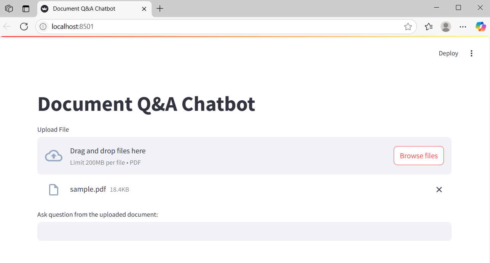
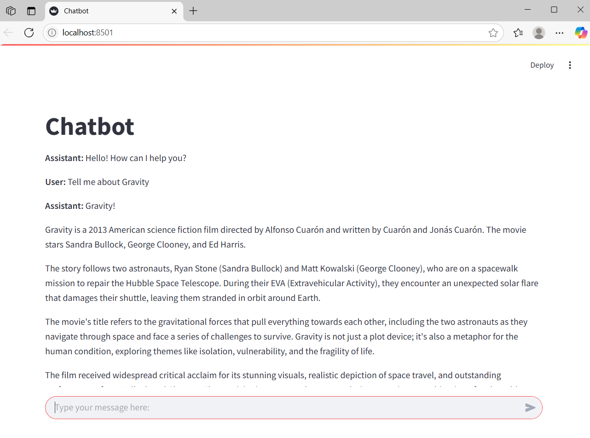

# GenerativeAI-Project

# Document Q\&A & Conversational Chatbot Repository

> Two Streamlit apps leveraging LangChain and Ollama to demonstrate Retrieval‑Augmented Generation (RAG) for document Q\&A and a conversational chatbot.

## 📁 Project Structure

* **Q\&A\_bot.py**: Document-based Q\&A chatbot
* **chatbot\_con.py**: Free‑form conversational chatbot
* **requirements.txt**: Python dependencies
* **LICENSE**: Project license

---

## 🔍 Overview

**Q\&A\_bot.py** implements a RAG pipeline to:

1. **Load & Chunk PDFs**: Uses `langchain_community.document_loaders.PyPDFLoader` and `CharacterTextSplitter` to split uploaded PDFs into overlapping chunks.
2. **Embed & Index**: Generates embeddings via `sentence-transformers/all-MiniLM-L6-v2` and stores them in a FAISS index.
3. **Retrieve & Answer**: Retrieves top‑k chunks and feeds them plus the user question to an Ollama LLM (`llama3:8b`).

**chatbot\_con.py** builds a simple chat interface:

1. **Session History**: Maintains messages in `st.session_state.messages`.
2. **LLM Integration**: Uses `langchain_ollama.ChatOllama` to process the conversation history.

---

## 🛠️ Prerequisites

* Python 3.9+
* [Ollama](https://ollama.com/) daemon with `llama3:8b` model
* `pip` package manager

---

## ⚙️ Installation

1. **Clone the repo**

   ```bash
   git clone https://github.com/sploitengineer/GenerativeAI-Project
   cd GenerativeAI-Project
   ```

2. **(Optional) Virtual environment**

   ```bash
   python -m venv venv
   source venv/bin/activate      # Windows: venv\Scripts\activate
   ```

3. **Install dependencies**

   ```bash
   pip install -r requirements.txt
   ```

---

## 🚀 Running the Apps

### 1. Document Q\&A Chatbot

```bash
streamlit run Q&A_bot.py
```

* **Upload PDF(s)** via the file uploader.
* **Ask Questions** in the text input to receive answers based on document context.

<details>
  <summary>📸 Screenshot</summary>
  
</details>

### 2. Conversational Chatbot

```bash
streamlit run chatbot_con.py
```

* **Enter messages** in the chat input box.
* **View** user and assistant messages in the chat history.

<details>
  <summary>📸 Screenshot</summary>
  
</details>

---

## 🔧 Configuration

* In **Q\&A\_bot.py**, adjust:

  * `chunk_size` & `chunk_overlap` for text splitting
  * `search_kwargs={"k": 3}` to change retrieval count
* In both scripts, change `model="llama3:8b"` to use a different Ollama model.

---

## 📄 License

This project is licensed under the MIT License — see [LICENSE](LICENSE) for details.
